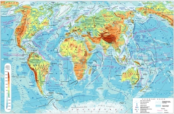
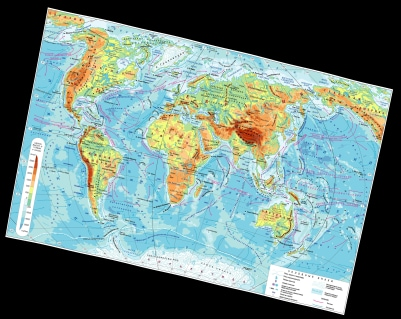

# GeoConformImage

## Description

Conformal Transform image.

## Depends

* [GCC](https://gcc.gnu.org/)
* [FreeImage](https://freeimage.sourceforge.io/)

## Build

Type:
```sh
make
```

## Usage

### Exec

Type:
```sh
geoconformimage [options] <input_image> <output_image>
```

### Options

```sh
    -i N    iteration set (default = 10)
    -p str  string conform params: "A0,B0,A1,B1,[...,A9,B9]"
    -r str  string region image: "Xws,Yws,Xne,Yne"
    -h      this help
```

### Example

  
```sh
./geoconformimage -p 10,10,0.97,0.25,0.0001,0.0001 -r 0,0,100,200 world-rus.jpg world-rus.jpg.out.png
GeoConformImage.
https://github.com/Geo-Linux-Calculations/geoconformimage/.

Parameter trans set 10,10,0.97,0.25,0.0001,0.0001 (6).
Parameter rect set 0,0,100,200 (4).
Input= world-rus.jpg
Result rect from "(-7.243214,12.653406)-(107.243217,187.346588)" to "(-47.095795,20.433907)-(111.725273,220.195557)".
Output= world-rus.jpg.out.png
```


## Links

* [geofindkey](https://github.com/Geo-Linux-Calculations/geofindkey) - Conformal transformation (C, 1,2 power).
* [gnumeric-ols](https://github.com/Geo-Linux-Calculations/gnumeric-ols) - Conformal transformation (Gnumeric spreadsheets, 1-4 power).

## Copyright

Public Domain Mark 1.0
 No Copyright


2021 zvezdochiot.

---

 GIT: https://github.com/Geo-Linux-Calculations/geoconformimage

 Email: zvezdochiot@users.sourceforge.net

